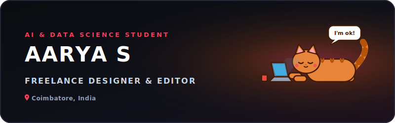

<!-- 
=========================================
GPL PROFILE README TEMPLATE
=========================================
To customize this profile README for yourself:
1. Replace all occurrences of "aaryasaaryas01-hue" with your own GitHub username.
2. Replace "AARYA SAARYAS" with your own name.
3. Update the Social links and opportunity lists with your own information.
4. Edit "assets/header.svg" to change the banner text to match your profile.
=========================================
-->

  <!-- Reference your local banner SVG. GitHub will render this cleanly on your profile page -->
  

  <!-- Social Badges - Replace URLs with your own handles -->
  
  
  
  

  <!-- Dynamic Stats Badges -->
  
  
  

  ♦

## About Me

I am an **Artificial Intelligence and Data Science** undergraduate student based in Coimbatore, India. I operate at the intersection of mathematical rigor (logic) and creative problem-solving. My core academic and technical focus is developing pipelines that extract actionable patterns from structured and unstructured datasets.

*   ⚡ **Fun fact**: I believe coding is just another medium for creative expression.

 

<table width="100%" border="0" cellpadding="10" cellspacing="0">
  <tr>
    <td bgcolor="#0f111a" style="border: 1px solid #2e3047; border-radius: 8px;">
      <h3 style="margin-top: 0;">🎓 OPEN TO OPPORTUNITIES</h3>
      

        <b>Roles:</b> Data Science Internships, Machine Learning Engineering, Research Fellowships, Software Development  
        <b>Focus Areas:</b> Deep Learning, Computer Vision, MLOps, NLP, Predictive Modeling  
        <b>Location:</b> Coimbatore, India (Open to Hybrid / Remote)
      

    </td>
  </tr>
</table>

  ♦

## Tech Stack & Skills

| Category | Badges / Tools |
| :--- | :--- |
| **Languages** |       |
| **AI & Machine Learning** |      |
| **Frontend & Backend** |      |
| **Cloud & DevOps** |    |
| **Databases & Design Tools** |            |

 

## Coding Profiles

  <!-- Replace href URLs with your profile links -->
  
  &nbsp;&nbsp;
  
  &nbsp;&nbsp;
  

  ♦

## GitHub Analytics

  <!-- Left Side: GitHub Readme Streak Stats -->
  
  <!-- Right Side: GitHub Readme Activity Graph -->
  

 

<h3 align="center">Contribution Snake</h3>

  <!-- Once the GitHub Actions workflow runs, it commits this file to the 'output' branch -->
  

 

 

<!-- Footer section -->

  AARYA SAARYAS • 2026 &nbsp;&nbsp;&nbsp;&nbsp;&nbsp;&nbsp;&nbsp;&nbsp;&nbsp;&nbsp;&nbsp;&nbsp;&nbsp;&nbsp;&nbsp;&nbsp;&nbsp;&nbsp;&nbsp;&nbsp;&nbsp;&nbsp;&nbsp;&nbsp;&nbsp;&nbsp;&nbsp;&nbsp;&nbsp;&nbsp;&nbsp;&nbsp;&nbsp;&nbsp;&nbsp;&nbsp;&nbsp;&nbsp;&nbsp;&nbsp;&nbsp;&nbsp;&nbsp;&nbsp;&nbsp;&nbsp;&nbsp;&nbsp;&nbsp;&nbsp;&nbsp;&nbsp;&nbsp;&nbsp;&nbsp;&nbsp;&nbsp;&nbsp;&nbsp;&nbsp;&nbsp;&nbsp;&nbsp;&nbsp;&nbsp;&nbsp;&nbsp;&nbsp;&nbsp;&nbsp;&nbsp;&nbsp;&nbsp;&nbsp;&nbsp;&nbsp;&nbsp;&nbsp;&nbsp;&nbsp;&nbsp;&nbsp;&nbsp;&nbsp;&nbsp;&nbsp;&nbsp;&nbsp;&nbsp;&nbsp;&nbsp;&nbsp;&nbsp;&nbsp;&nbsp;&nbsp;&nbsp;&nbsp;&nbsp;&nbsp;&nbsp;&nbsp;&nbsp; DESIGNED WITH PRECISION

